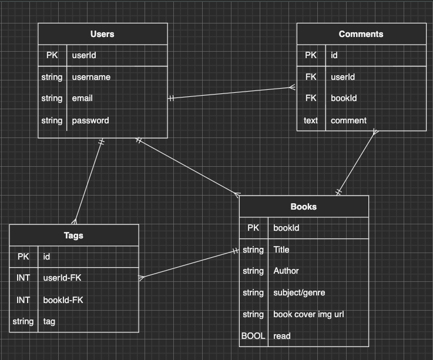

# The Bibliofiles
---

## Are you an avid reader? Do you have trouble keeping track of the books you've read? Find a book you want to read later and need a central place to write it down? Then *The Bibliophiles* is for you!

---

## API
### [Open Library](https://openlibrary.org/developers/api)

### [Search Lord of the Rings](http://openlibrary.org/search.json?title=the+lord+of+the+rings)

---

## ERDS

### MVP ERD

### STRETCH ERD

---

## RESTful Routing Chart

| VERB | URL pattern | Action \(CRUD\) | Description |
| :--- | :--- | :--- | :--- |
| GET | /login | Show \(Read\) | render login form |
| GET | /logout | Show \(Read\) | remove cookies and redirect to home |
| GET | /signup | New \(Read\) | render signup form |
| POST | /signup |Create \(Create\) | create new user from form |
| GET | /user/profile | Show \(Read\) | shows user profile |
| PUT | /books/:id | Update \(Update\) | updates the user's tags on a specific book |
| DELETE | /books/:id | Destroy \(Delete\) | deletes the specific book from the user's saved books |
| GET | / | Show \(Read\) | render homepage with search form|
| GET | /books/:title | Show \(Read\) | renders results from search |
| GET | /books/:id | Show \(Read\) | renders detailed info on specific book & allows it to be favorited|

---

## User View Wireframes

### Sign Up

### Login

### User Profile

### Homepage

### Search Results

### Book Details

### Save Book

---

## User Stories
- As a user I want to search books by title
- As a user I want to save books for later
- As a user I want to see detailed info on the specific books
- As a user I want to keep track of which books I've read
- As a user I want to keep track of books I want to read

---

## MVP
- Able to crate a new user
- User info encrypted
- Password Hashed
- Error messages for incorrect/invalid login info
- Error messages for incorrect/invalid sign up info
- User able to search books by title
- User able to save books
- User able to mark saved books as read/not read
- User able to attatch tags to saved books

---

## Stretch
- Users able to create public comments on books
- Users able to publicly rate books
- Users able to see how many saves a book has
- Book save form is modal
- Dark Mode 🌗
